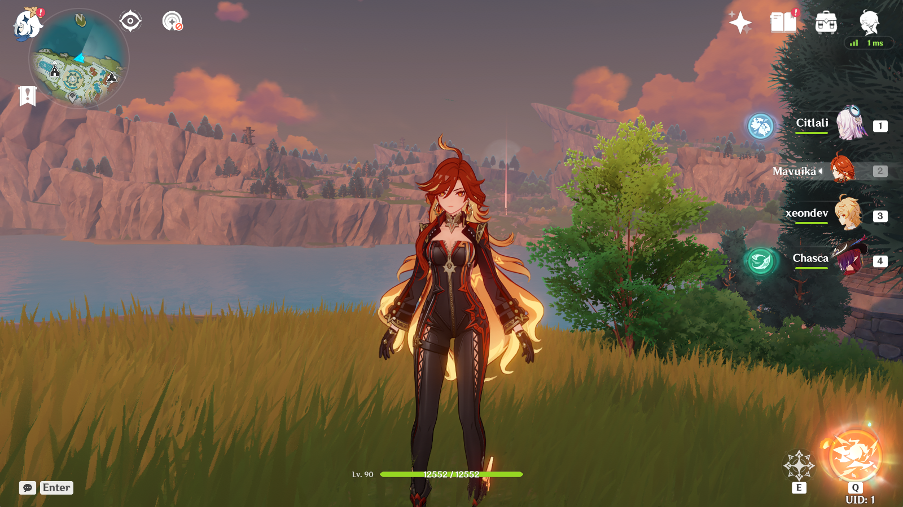

# sakura-rs


## About
**sakura-rs** is an open source **Genshin Impact** server emulator. Built on top of [Bevy ECS](https://bevyengine.org/learn/book/getting-started/ecs/), it prioritizes performance and implementation completeness to provide a smooth and efficient gameplay.

## Implementation Status
- `sakura-proto`: a version-agnostic library defining protocol structures with ability to convert their format between different protocol versions.
- `sakura-data`: a library for parsing game data, supporting their initial form of binary blobs, without having to rely on 3rd-party data providers.
- Authentication and encryption protocols are implemented with the same specifications as the official server.
- Extensible and easy-to-understand codebase with use of Bevy's plugin system.

## Getting started
### Requirements
- [Rust](https://www.rust-lang.org/tools/install)
- [PostgreSQL](https://www.postgresql.org/download/)
### Setup
#### a) building from sources (preferred)
```sh
git clone https://git.xeondev.com/sakura-rs/sakura-rs.git
cd sakura-rs
cargo run --release --bin sakura-sdk-server
cargo run --release --bin sakura-dispatch-server
cargo run --release --bin sakura-gate-server
cargo run --release --bin sakura-game-server
```
#### b) using pre-built binaries
Navigate to the [Releases](https://git.xeondev.com/sakura-rs/sakura-rs/releases) page and download the latest release for your platform.<br>
Launch all services: `sakura-sdk-server`, `sakura-dispatch-server`, `sakura-gate-server`, `sakura-game-server`
### Configuration
You should configure each service using their own config files. They're being created in current working directory upon first startup.
#### Database section
You have to specify credentials to work with **PostgreSQL**
##### An example of database configuration:
```toml
[database]
host = "localhost:5432"
user_name = "postgres"
password = ""
db_name = "sakura"
```
### Data
All necessary assets are present in this repository. This includes `ExcelBinOutput`, `BinOutput` and regional keys & configuration.
### Connecting
You have to get a compatible game client. Currently supported one is `OSCBWin5.1.50`, you can [get it here](https://git.xeondev.com/xeon/3/raw/branch/3/GenshinImpact_5.1.50_reversedrooms.torrent). Next, you have to apply [this patch](https://git.xeondev.com/reversedrooms/hk4e-patch/releases), it allows you to connect to local server and replaces RSA encryption keys with custom ones.
## Community
[Our Discord Server](https://discord.gg/reversedrooms) is open for everyone who's interested in our projects!
## Support
Your support for this project is greatly appreciated! If you'd like to contribute, feel free to send a tip [via Boosty](https://boosty.to/xeondev/donate)!